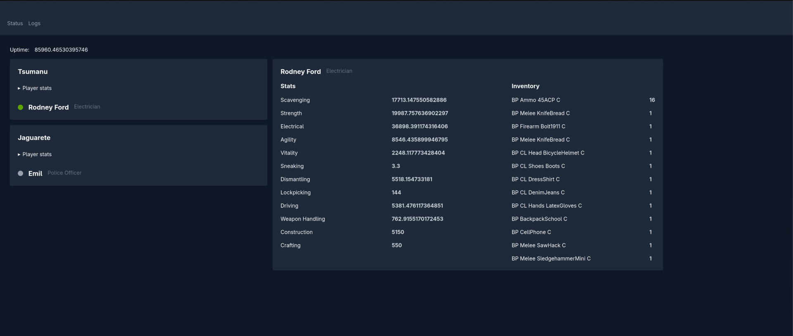
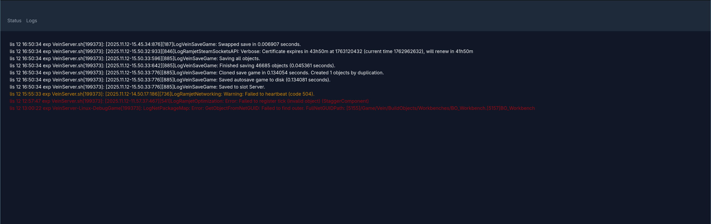

# Vein Dashboard

This is native, very light web server for Vein game.
It works in background consuming almost no resources.

Once compiled it can run on any Linux and will use Server Side Events to send updates about the game.

## Config file

You can change 

```toml
# Web server config
bind = "0.0.0.0"
port = 8765

# Vein dedicated server config
vein_server_bind = "http://vein.ita-prog.pl"
vein_server_port = 8080

# Interval how often emit events
refresh_interval_sec = 5
```

## Running

To run application you should set environment variable `ADMIN` with list of admins which can access server.

Admins should be separated with `,` and contains login and password separated by `:`.

Session is stored in memory by server and as cookie by browser.

### Examples

```
ADMINS=admin:admin vein-dashboard

ADMINS=foo:bar,login2:pass2 vein-dashboard
```

## Screenshots




## Roadmap

* [X] Authorization
* [ ] Install command
* [ ] Icons
* [ ] Web config manipulation
* [ ] Vein dedicated server managment

## Architecture

### Communication

Server is checking logs and api periodically and send Server Sent Events to propagate results to all clients.

Once you are connected and authorized you will receive updates at regular intervals. Session will be updated on fly by server and requires no interactions.

In case of session expiration or attempt to access stream without unauthorization SSE socket will be closed immediately.

### Frontend

Web is using [lemonadejs](lemonadejs.com/) and [tailwindcss](https://tailwindcss.com/) to render frontend. Also it highly depends on [Custom Elements](https://developer.mozilla.org/en-US/docs/Web/API/Web_components/Using_custom_elements) but it's not using `ShadowRoot` since tailwindcss styles can't cross ShadowRoot borders.
#### Backend

Server itself is written in [Rust](https://rust-lang.org/). Almost no data is stored by server (only sessions and admin credentials) so is very light resources wise. While idle and not waiting for another data fetch it's not using almost any CPU & RAM. This changes just after data fetch when it must push updates to clients but should never use more than 20 megabytes.
